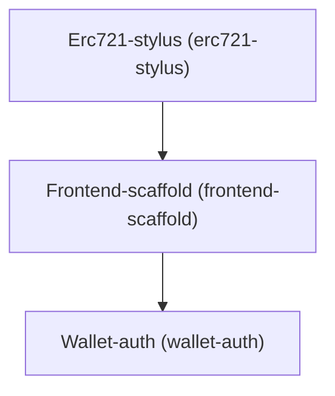

# Architecture

## Dependency Graph

```mermaid
graph TD
  8f3c7453["Erc721-stylus (erc721-stylus)"]
  6bba2410["Frontend-scaffold (frontend-scaffold)"]
  4a9376ef["Wallet-auth (wallet-auth)"]
  8f3c7453 --> 6bba2410
  6bba2410 --> 4a9376ef
```

## Execution / Implementation Order

1. **Erc721-stylus** (`8f3c7453`)
2. **Frontend-scaffold** (`6bba2410`)
3. **Wallet-auth** (`4a9376ef`)
